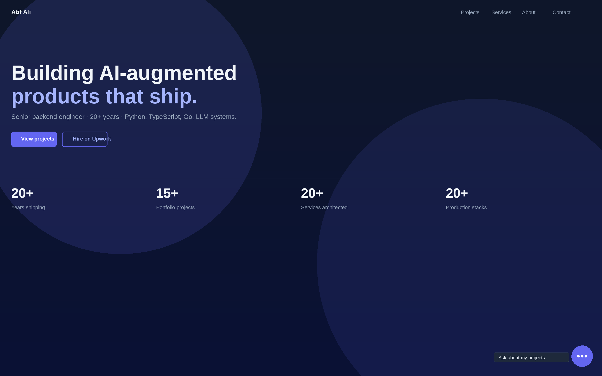
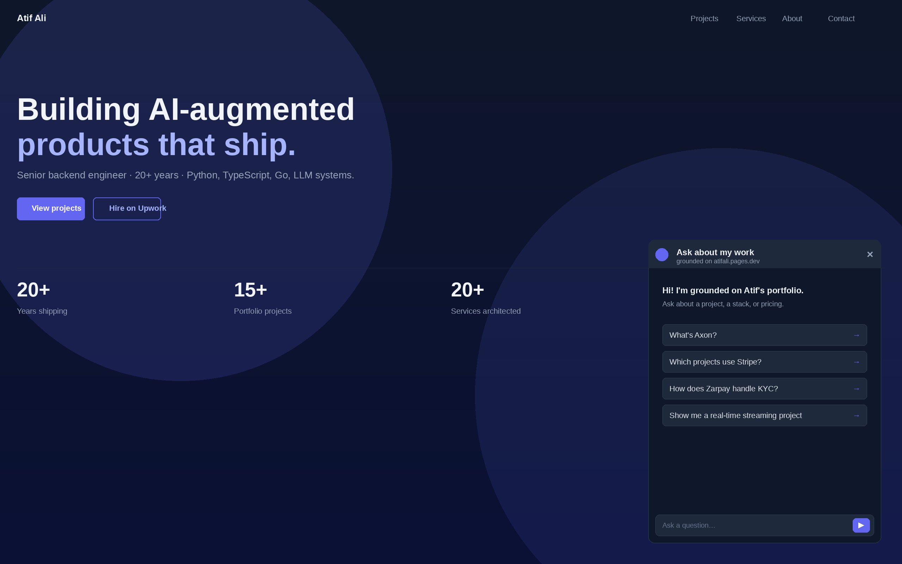
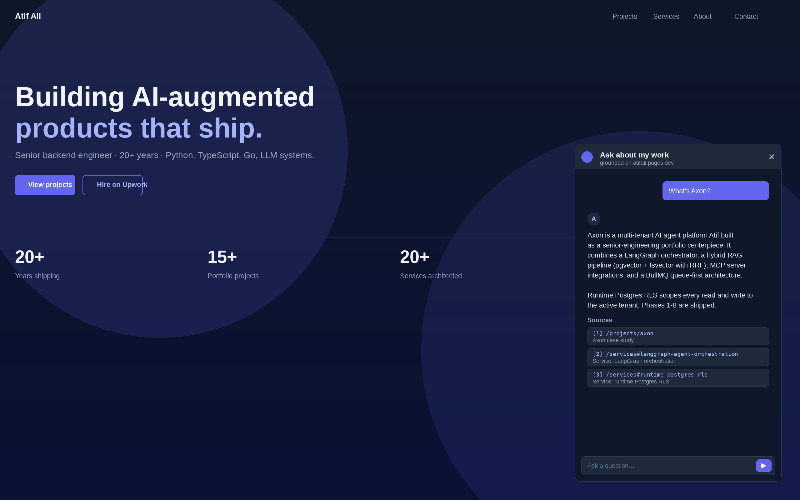
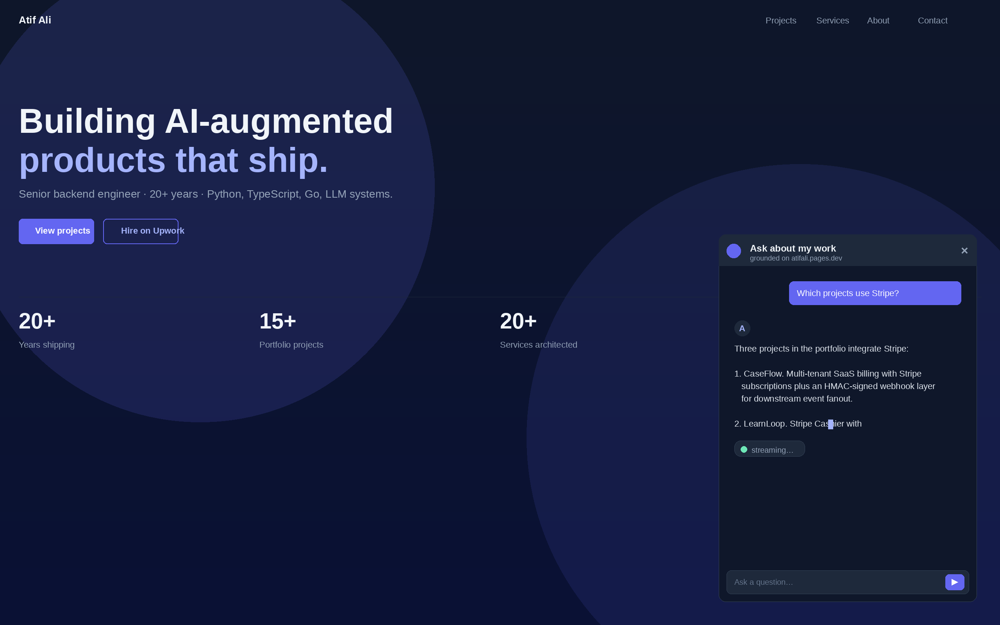

# Portfolio Bot

An embeddable RAG chatbot grounded on the content of [atifali.pages.dev](https://atifali.pages.dev). Visitors land on the portfolio, open the chat bubble, and ask things like "what's Axon?" or "which projects use Stripe?" The bot answers with citations linking back to the actual case studies.

## What it does

Portfolio Bot is a chat widget that mounts to the bottom-right corner of every page on the portfolio site. The conversation is grounded in the project READMEs and case studies behind the site, so answers stay close to the source instead of drifting into generic LLM output.

Each response carries inline citations pointing at the project page that supplied the context. Conversation history persists in `localStorage` so a returning visitor picks up where they left off.

## Features

- Embeddable vanilla JS chat widget, no framework runtime on the host page
- Citation-backed answers with links to the source case study
- Streaming responses for fast first-token feedback
- Conversation memory across page navigation
- Per-IP rate limiting and a prompt-injection guard
- Optional Slack handoff for live questions the bot won't try to answer

## Why it exists

The bot is the proof artifact for an "AI Chatbot with RAG" service offering. A buyer searching for a chatbot for their own website wants to see a chatbot embedded in a website, talking about that website's content. Portfolio Bot is exactly that, immediately verifiable on the portfolio homepage.

## Positioning

Most low-cost chatbot offerings are bare LLM wrappers with no retrieval, no citations, no abuse protection. Portfolio Bot demonstrates the upgraded shape: a retrieval pipeline, source attribution, conversation memory, and a clean embed story.

## Phases

- Phase 0: Worker scaffold and Vectorize binding
- Phase 1: Markdown ingestion pipeline (chunk, embed, upsert)
- Phase 2: Retrieval and grounded generation endpoint
- Phase 3: Inline citations
- Phase 4: Vanilla JS chat widget with streaming
- Phase 5: Production embed on atifali.pages.dev
- Phase 6: Rate limiting and prompt-injection guard
- Phase 7: Optional Slack handoff

## Screenshots

